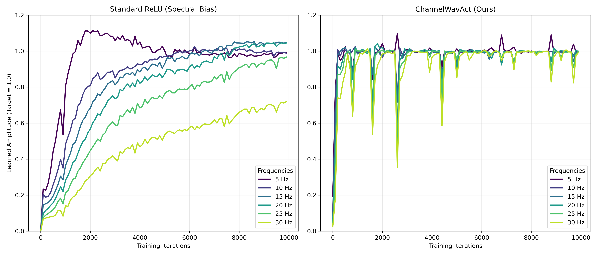
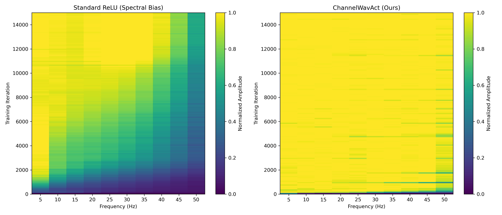

# Supplementary Material for Rebuttal

This anonymous repository contains the supplementary high-resolution figures referenced in our rebuttal, specifically addressing the empirical validation of spectral bias and learning dynamics.

---

### Table 1: Ablation Study on Selective Regularization
**Description:** Empirical comparison justifying our design choice to regularize *only* the magnitude parameters while keeping the geometric parameters flexible.

| Regularization Strategy | Last Acc (%) | Avg Acc (%) | Forgetting (%) | Time (s) |
| :--- | :---: | :---: | :---: | :---: |
| **Magnitude-only (Ours)** | **30.2 ± 0.5** | **43.6 ± 0.9** | **16.7 ± 0.5** | **1322.1** |
| Magnitude + Geometry | 30.2 ± 0.6 | 43.7 ± 1.0 | 16.8 ± 0.6 | 1331.5 |
| Geometry-only | 29.6 ± 0.3 | 43.3 ± 1.0 | 17.7 ± 0.4 | 1349.2 |

* **Conclusion:** Regularizing only the magnitude parameters provides the optimal balance between stability and plasticity. Constraining the geometric parameters severely limits the network's ability to learn new knowledge (highest forgetting), while regularizing both adds unnecessary computational complexity without meaningful performance gains.

---

### Figure 1: Fourier Amplitude Evolution during Multi-Frequency Regression
**Description:** We replicated "Experiment 1" from Rahaman et al. (2019) to track the discrete Fourier amplitude of the network's prediction at specific frequencies (5Hz to 30Hz) over 10,000 iterations.

  

* **Left (Standard ReLU):** Exhibits severe spectral learning bias. High frequencies (25Hz, 30Hz) fail to converge.
* **Right (ChannelWavAct):** Breaks the convergence bottleneck, learning high and low frequencies almost simultaneously.

---

### Figure 2: Heatmap of Frequency-Domain Learning Dynamics
**Description:** A broader frequency-domain analysis (5Hz to 50Hz) over 15,000 training iterations, visualized as a 2D heatmap.

  

* **Left (Standard ReLU):** The diagonal boundary clearly shows that high-frequency regions (>30Hz) remain poorly fit (dark blue) even after extensive training.
* **Right (ChannelWavAct):** The network uniformly and rapidly illuminates the entire frequency grid in the very early stages of training, explicitly validating the alleviation of spectral bias.
